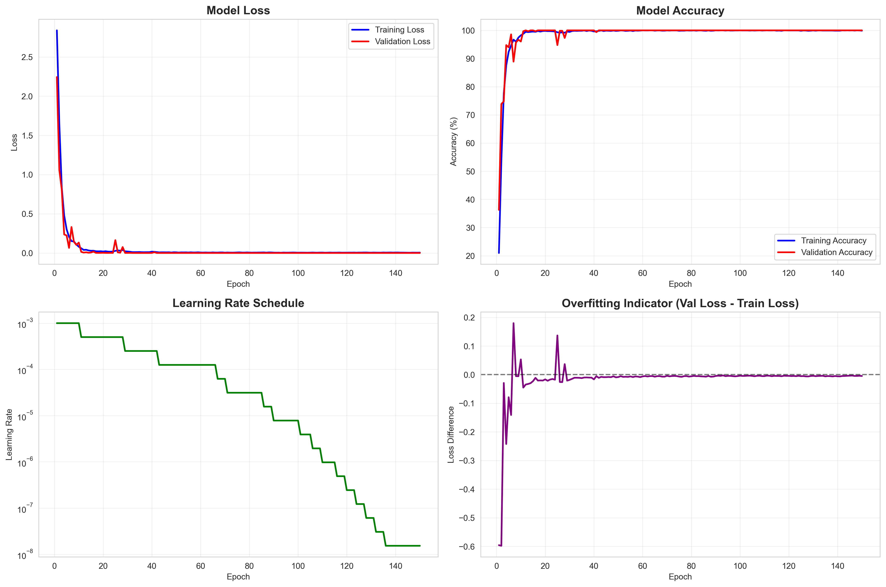
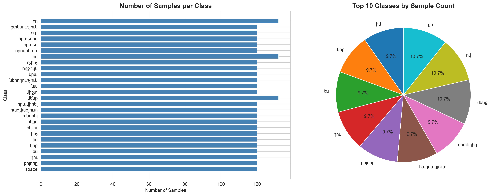
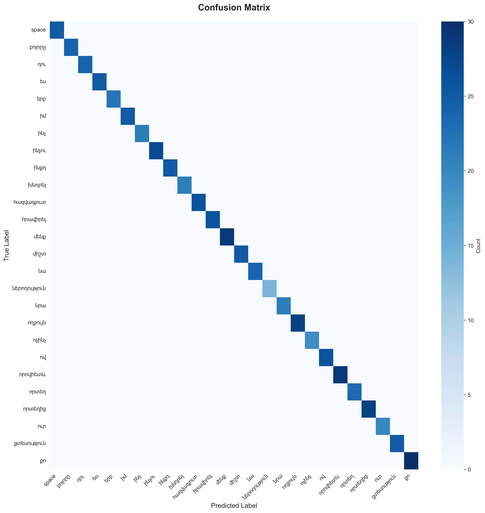

# Sign Language Recognition System

A real-time sign language recognition system that uses MediaPipe for pose and hand tracking, and a PyTorch-based Bidirectional GRU with Attention mechanism for sign classification. The system supports Armenian sign language with real-time inference and LLM-based sentence generation.

  

## 📸 Visualizations

The system includes comprehensive visualization tools to analyze training progress, dataset distribution, and model performance:

| Visualization | Description |
|--------------|-------------|
|  | Training and validation metrics over epochs |
|  | Class distribution and sample counts |
|  | Per-class classification performance |

*Note: These visualizations are generated by running `python visualize.py` after training*

## 🎯 Overview

This project enables real-time recognition of sign language gestures through a webcam. It processes video frames to extract pose and hand landmarks, applies advanced preprocessing (normalization and motion deltas), and uses a deep learning model to classify signs. The system can also generate meaningful sentences from recognized signs using an LLM.

### Key Features

- **Real-time Recognition**: Live sign language detection via webcam
- **Bidirectional GRU with Attention**: Advanced neural network architecture for temporal pattern recognition
- **Advanced Preprocessing**: Translation-invariant normalization and motion delta features
- **LLM Integration**: Generate meaningful sentences from recognized signs using Ollama
- **Data Augmentation**: Automatic scaling and jitter augmentation for robust training
- **Armenian Language Support**: Pre-trained for Armenian sign language vocabulary

## 📁 Project Structure

```
Arsen_AI/
├── main.py                      # Real-time inference application
├── train_model.py              # Model training script
├── visualize.py                # Training metrics and data visualization
├── my_functions.py             # Keypoint extraction utilities
├── augmentation.py             # Video augmentation pipeline
├── llm_sentence_generator.py  # LLM-based sentence generation
├── dataset/                    # Training data (processed sequences)
│   ├── space/
│   ├── բոլորը/
│   ├── դու/
│   └── ... (26 sign classes)
├── videos/                     # Source videos for augmentation
│   └── ... (original video files)
├── best_model.pth             # Trained model weights
├── class_mapping.npy          # Class name to index mapping
└── training_history.json      # Training metrics (generated)
```

## 🚀 Quick Start

### Installation

1. **Clone or download the project**

2. **Create a virtual environment** (recommended):
```bash
python -m venv .venv
.venv\Scripts\activate  # Windows
# or
source .venv/bin/activate  # Linux/Mac
```

3. **Install dependencies**:
```bash
pip install -r requirements.txt
```

### Basic Usage

1. **Train the model**:
```bash
python train_model.py --data_dir dataset --epochs 100
```

2. **Run real-time recognition**:
```bash
python main.py
```

3. **Visualize training results**:
```bash
python visualize.py
```

## 📊 System Architecture

### Data Pipeline

```
Video → MediaPipe → Keypoints (225) → Preprocessing → Features (450) → Model → Prediction
```

1. **Video Capture**: Webcam or video file input
2. **Landmark Detection**: MediaPipe extracts pose and hand landmarks
3. **Preprocessing**: 
   - Normalization (translation invariance)
   - Motion deltas (velocity features)
4. **Model Inference**: GRU + Attention network
5. **Post-processing**: Smoothing, confidence thresholding
6. **Sentence Generation**: LLM-based sentence formation (optional)

### Visual Overview


*Data flow from video input to sign classification*

### Model Architecture

**SignLanguageGRU** - Bidirectional GRU with Attention

```
Input: (batch_size, 20, 450)
    ↓
Bidirectional GRU (2 layers, 128 hidden units)
    ↓
Attention Mechanism (learns important frames)
    ↓
BatchNorm1d
    ↓
FC Layer (128 → 64) + ReLU + Dropout(0.4)
    ↓
FC Layer (64 → num_classes)
    ↓
Output: (batch_size, num_classes)
```

**Key Components**:
- **Bidirectional GRU**: Captures temporal patterns in both forward and backward directions
- **Attention Mechanism**: Automatically weights important frames in the sequence
- **BatchNorm**: Normalizes activations for stable training
- **Dropout**: Prevents overfitting

**Model Performance Visualization**:

*Classification accuracy and confusion patterns across all sign classes*

### Preprocessing Pipeline

The system transforms raw keypoints (225 features) into enriched features (450 features):

1. **Normalization (Translation Invariance)**:
   - Pose landmarks normalized relative to nose
   - Hand landmarks normalized relative to wrist
   - Makes recognition position-invariant

2. **Motion Deltas (Velocity Features)**:
   - Calculates frame-to-frame differences
   - Captures temporal dynamics and movement patterns
   - First frame padded with zeros

3. **Feature Concatenation**:
   - Combines normalized features (225) + delta features (225) = 450 total

## 📖 Detailed Usage

### 1. Data Preparation

**Option A: From Videos** (Recommended)
```bash
python augmentation.py
```
- Processes videos from `videos/` directory
- Extracts keypoints using MediaPipe
- Applies scaling and jitter augmentations
- Saves sequences to `dataset/` directory

**Option B: Direct Keypoint Files**
- Organize `.npy` files in class folders
- Each file should be shape `(20, 225)` (20 frames, 225 features)

### 2. Model Training

**Basic Training**:
```bash
python train_model.py --data_dir dataset --epochs 100
```

**Advanced Training**:
```bash
python train_model.py \
    --data_dir dataset \
    --seq_len 20 \
    --epochs 150 \
    --batch_size 64 \
    --hidden_size 256 \
    --num_layers 3 \
    --dropout 0.3 \
    --lr 0.0005
```

**Training Arguments**:
- `--data_dir`: Dataset directory path (default: `dataset`)
- `--seq_len`: Sequence length in frames (default: 20)
- `--epochs`: Number of training epochs (default: 100)
- `--batch_size`: Batch size (default: 32)
- `--hidden_size`: GRU hidden size (default: 128)
- `--num_layers`: Number of GRU layers (default: 2)
- `--dropout`: Dropout rate (default: 0.3)
- `--lr`: Learning rate (default: 0.001)

**Output**:
- `best_model.pth`: Best model based on validation loss
- `class_mapping.npy`: Class name to index mapping
- `training_history.json`: Training metrics for visualization

### 3. Real-time Inference

```bash
python main.py
```

**Controls**:
- **Spacebar**: Toggle word collection mode
  - First press: Start collecting words
  - Second press: Generate sentence from collected words
- **'q'**: Quit application

**Features**:
- Real-time pose and hand landmark visualization
- Live prediction with confidence scores
- Prediction smoothing via history window
- LLM-based sentence generation (requires Ollama)

### 4. Visualization

```bash
python visualize.py
```

Generates visualizations:
- **Training Curves**: Loss and accuracy over epochs
- **Dataset Statistics**: Class distribution and sample counts
- **Confusion Matrix**: Model performance per class
- **Model Architecture**: Visual representation of the network

**Example Visualizations**:

#### Dataset Statistics

*Distribution of samples across sign language classes*


#### Model Performance

*Per-class classification accuracy and confusion patterns*

## 🔬 Technical Details

### Data Format

**Raw Keypoints** (225 features per frame):
- Pose landmarks: 99 features (33 points × 3 coordinates: x, y, z)
- Left hand: 63 features (21 points × 3 coordinates)
- Right hand: 63 features (21 points × 3 coordinates)

**Preprocessed Features** (450 features per frame):
- Normalized features: 225 features
- Motion deltas: 225 features
- Sequence length: 20 frames

**File Structure**:
```
dataset/
├── class_name_1/
│   ├── sequence_1.npy  # Shape: (20, 225)
│   ├── sequence_2.npy
│   └── ...
├── class_name_2/
│   └── ...
```

### Model Details

- **Input Size**: 450 features (20 frames × 450 features)
- **Output Size**: Number of sign classes (26 for Armenian vocabulary)
- **Parameters**: ~200K-500K depending on configuration
- **Training Time**: ~30-60 minutes on CPU, ~5-10 minutes on GPU

### Performance Metrics

The model tracks:
- Training loss and accuracy
- Validation loss and accuracy
- Learning rate scheduling
- Best model checkpointing

## 🛠️ Advanced Features

### LLM Sentence Generation

The system integrates with Ollama for sentence generation:

1. **Install Ollama**: https://ollama.ai/
2. **Pull a model**:
```bash
ollama pull llama3.2:1b
```
3. **Start Ollama server**:
```bash
ollama serve
```

The system will automatically use the LLM when available, otherwise falls back to simple concatenation.

### Custom Vocabulary

To add new signs:
1. Record videos in `videos/your_sign/`
2. Run `augmentation.py` to process
3. Retrain the model with new data

### Model Export

The model can be exported for deployment:
- PyTorch format: `.pth` (current)
- ONNX format: Can be added for cross-platform deployment

## 📈 Performance Optimization

### Training Tips

1. **Data Quality**:
   - Ensure consistent lighting and camera position
   - Collect diverse samples (different people, angles, speeds)
   - Aim for 50+ sequences per class

2. **Hyperparameter Tuning**:
   - Increase `hidden_size` for more complex patterns
   - Adjust `dropout` to prevent overfitting
   - Use learning rate scheduling (automatic)

3. **Hardware Acceleration**:
   - Use GPU for faster training
   - Enable `pin_memory=True` in DataLoader
   - Use mixed precision training (future enhancement)

### Inference Optimization

1. **Reduce Confidence Threshold**: For faster predictions
2. **Adjust Smoothing Window**: Balance responsiveness vs. stability
3. **Use GPU**: Faster inference if available
4. **Model Quantization**: Reduce model size for edge devices (future)

## 🐛 Troubleshooting

### Common Issues

**"No model file found"**
- Solution: Train the model first using `train_model.py`
- Ensure `best_model.pth` exists in project root

**"Expected 225 features" error**
- Check MediaPipe detection (pose and hands visible)
- Verify camera is working
- Ensure proper lighting

**Low prediction accuracy**
- Collect more training data
- Check class balance in dataset
- Adjust confidence threshold
- Review preprocessing pipeline

**CUDA/GPU not detected**
- Model automatically falls back to CPU
- For GPU: Install PyTorch with CUDA support
- Check GPU availability: `torch.cuda.is_available()`

**Ollama connection errors**
- Ensure Ollama server is running: `ollama serve`
- Check model is available: `ollama list`
- System will fall back to simple concatenation if unavailable

## 📚 Dependencies

### Core Libraries
- `torch>=2.0.0` - PyTorch deep learning framework
- `mediapipe>=0.9.0` - Pose and hand landmark detection
- `opencv-python>=4.5.0` - Video processing
- `numpy>=1.21.0` - Numerical computations
- `scikit-learn>=1.0.0` - Data preprocessing utilities

### Visualization
- `matplotlib>=3.5.0` - Plotting
- `seaborn>=0.12.0` - Statistical visualization

### Additional
- `tqdm>=4.62.0` - Progress bars
- `Pillow>=8.3.0` - Image processing
- `keyboard>=0.13.5` - Keyboard input
- `joblib>=1.1.0` - Model serialization

## 🎓 Educational Value

This project demonstrates:
- Deep learning for sequence classification
- Attention mechanisms in neural networks
- Real-time computer vision applications
- Data preprocessing and augmentation
- Model deployment and inference
- Integration with LLMs for NLP tasks

## 📝 License

This project is for educational and research purposes.

## 🙏 Acknowledgments

- **MediaPipe**: For excellent pose and hand tracking
- **PyTorch**: For flexible deep learning framework
- **Ollama**: For local LLM inference
- **Community**: For feedback and contributions

## 📧 Support

For issues, questions, or contributions:
- Check the troubleshooting section
- Review the code comments
- Ensure all dependencies are installed correctly

---

**Happy Signing!** 👐
